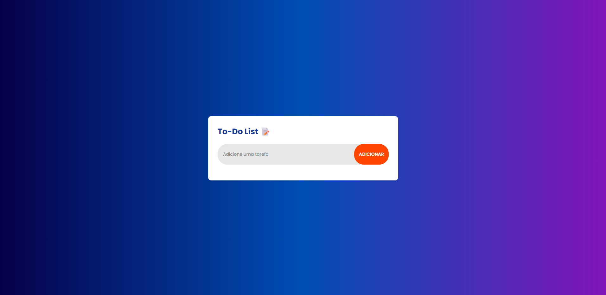

# ✅ To-Do List

Uma aplicação simples de lista de tarefas que permite adicionar, marcar como concluídas e excluir tarefas. O projeto salva automaticamente as tarefas no localStorage do navegador para persistência entre sessões.

---

## ✨ Funcionalidades

- 📝 **Adicionar Tarefas**: Insira novas tarefas por meio de um campo de texto e botão de adicionar.
- ✅ **Marcar como Concluída**: Marque tarefas concluídas com um clique no checkbox.
- ❌ **Remover Tarefas**: Exclua tarefas individualmente clicando no ícone de "X".
- 💾 **Persistência**: Todas as tarefas e seus status são armazenados localmente no navegador usando localStorage.
- ⚠️ **Validação de Entrada**: Evita que tarefas vazias sejam adicionadas.
- 📱 **Responsivo**: Design adaptado para diferentes tamanhos de tela.
- 🎨 **Estilo Moderno**: Gradiente de fundo, animações sutis e tipografia suave com a fonte *Poppins*.

---

## 🛠️ Tecnologias Utilizadas

- **HTML5**
- **CSS3**
  - Reset CSS
  - Layout com Flexbox
  - Estilização moderna com gradiente e efeitos de hover
- **JavaScript (Vanilla)**
  - Manipulação de DOM
  - Eventos e validações
  - localStorage

---

## 📂 Estrutura de Pastas

```
projeto-todo-list/
├── index.html
└── src/
    ├── css/
    │   ├── reset.css
    │   └── style.css
    └── js/
        └── script.js
```

---

## 🚀 Como Rodar o Projeto

1. Clone o repositório:

```bash
git clone https://github.com/endriusssantos/to-do-list
cd projeto-todo-list
```

2. Abra o arquivo index.html em seu navegador, ou use uma extensão como "Live Server" no VSCode.

---

## 💡 Possíveis Melhorias Futuras

- ✏️ Editar tarefas existentes.
- 📋 Filtro de tarefas (todas, concluídas, pendentes).
- 📱 Melhorias adicionais para mobile-first.

---

## 📸 Preview



---

## 🧑‍💻 Autor

Feito com 💙 por Endrius da Silva dos Santos